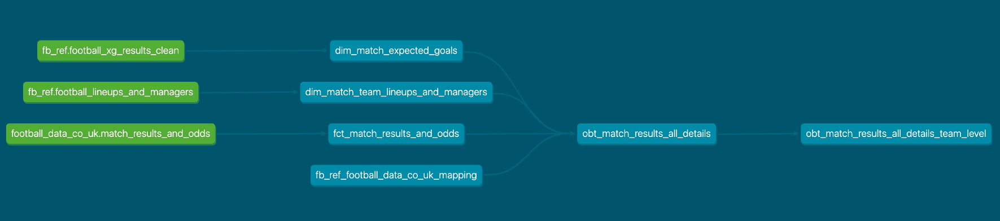

# AWS Football Data Pipeline 


## Description

A (work in progress) set of ELT pipelines to extract, load and combine data (such as basic match facts, expected
goals, team lineups and managers) on a _match-level_ basis from various football
data providers (currently [football-data.co.uk](https://www.football-data.co.uk) & [fb-ref.com](https://fbref.com/en/))
in order to gain greater insight and context for analytics and modeling purposes.
<br>
## (WIP) Pipeline Architecture Overview 
<br>


## Stack
- AWS Lambda
- AWS Glue
- AWS EventBridge
- AWS S3
- AWS SQS
- Docker
- Python, SQL
- Infra partially managed by Terraform; migration in progress
- DBT


# Ingestion Pipelines


*DISCLAIMER: This is an evolving piece of work, so the below may not always be fully up-to-date.*

### Basic Match Statistics & Bookmaker Prices

This data is obtained from https://football-data.co.uk, where basic match statistics
(goals, corners, cards, shots, etc) and market odds are available in CSV format (per season) for every major
European football league, going as far back as 30 years for certain leagues.

Raw data is extracted and loaded into a raw S3 bucket via a zip-deployed Lambda function.

Need to run the package script to build the zip file and the associated Lambda function resource (via Terraform): [football_data_co_uk_loader](terraform/lambda.tf)

```$ ./deploy.sh```


### Team Lineups & Managers

Data obtained from http://www.fbref.com

### 1. Extraction 

In order to respect the website rate limit, this meant that any backfill job spanning multiple
seasons would take several hours to finish, so deploying to the cloud made sense in this case.
The scraper application was run on a single EC2 instance via a docker container.

As the scraper is extracting nested data, the raw scraped data was piped to a Simple Queue Service
(SQS) queue, which I could later consume from and process raw data into a friendlier tabular format for
further analytics and queries.

### 2. Loading

The team lineups queue data was consumed and processed via a Dockerized [Lambda function](football_pipeline/expected_goals/fb_ref.py) and
loaded to S3.


# Data Model

With the raw data available in S3/Athena, a simple star schema data mart based on a match-level grain was developed:




- <b>fct_match_results_and_odds: </b>This table serves as the central fact table in our data model, capturing the core metrics of each football match, including match results and betting odds. It is the primary source of quantitative data and forms the backbone of our analytical queries.
Dimension Tables:

- <b>dim_match_expected_goals</b>: This dimension table contains expected goals (xG) data, providing insights into the quality of chances created by each team. It is used to enrich the central fact table with predictive performance metrics.

- <b>dim_match_team_lineups_and_managers</b>: This dimension table includes detailed information about team lineups and managers for each match. It adds contextual data to the fact table, allowing for deeper analysis of team compositions and managerial strategies.

- <b>obt_match_results_all_details</b>: This view combines the central fact table with the dimension tables, providing a single, comprehensive view of all match details. It integrates match results, betting odds, expected goals, and team lineups into one table.

- <b>obt_match_results_all_details_team_level</b>: This view presents data at the team level, transforming the typical home_team and away_team grain into a more accessible format for team-level analysis. It facilitates easier querying and comparison of team performance across matches.


