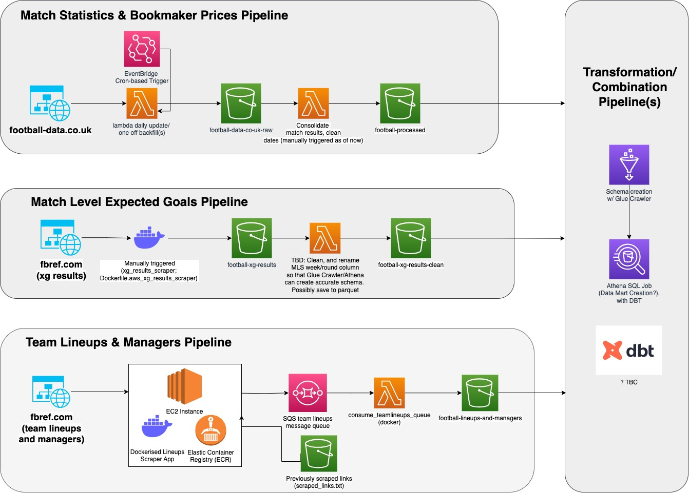

# AWS Football Data Pipeline 


## Description

A (work in progress) set of ELT pipelines to extract, load and combine data (such as basic match facts, expected
goals, team lineups and managers) on a _match-level_ basis from various football
data providers (currently [football-data.co.uk](https://www.football-data.co.uk) & [fb-ref.com](https://fbref.com/en/))
in order to gain greater insight and context for analytics and modeling purposes.
<br>
## (WIP) Pipeline Architecture Overview 
<br>



## Stack
- AWS Lambda
- AWS Glue
- AWS EventBridge
- AWS S3
- AWS SQS
- Docker
- Python, SQL
- Infra partially managed by Terraform; migration in progress
- DBT (WIP)


## Data Source Pipelines


*DISCLAIMER: This is an evolving piece of work, so no guarantees that the below steps are fully up-to-date.*

### Basic Match Statistics & Bookmaker Prices

This data is obtained from https://football-data.co.uk, where basic match statistics
(goals, corners, cards, shots, etc) and market odds are available in CSV format (per season) for every major
European football league, going as far back as 30 years for certain leagues.

Raw data is extracted and loaded into a raw S3 bucket via a zip-deployed Lambda function.

Need to run the package script to build the zip file and the associated Lambda function resource (via Terraform): [football_data_co_uk_loader](terraform/lambda.tf)

```$ ./deploy.sh```


### Team Lineups & Managers

Data obtained from http://www.fbref.com

### 1. Extraction 

In order to respect the website rate limit, this meant that any backfill job spanning multiple
seasons would take several hours to finish, so deploying to the cloud made sense in this case.
The scraper application was run on a single EC2 instance via a docker container.

As the scraper is extracting nested data, the raw scraped data was piped to a Simple Queue Service
(SQS) queue, which I could later consume from and process raw data into a friendlier tabular format for
further analytics and queries.

### 2. Loading

The team lineups queue data was consumed and processed via a Dockerized [Lambda function](docker/Dockerfile.aws_team_lineups_loader) and
loaded to S3.

TBC

### Expected Goals ('Xg') Data

TBD


